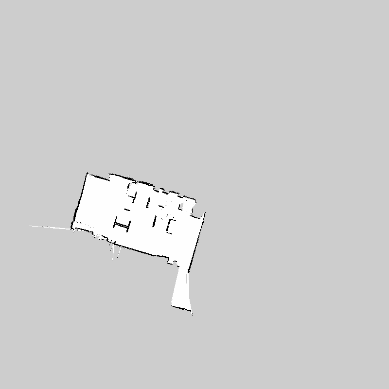
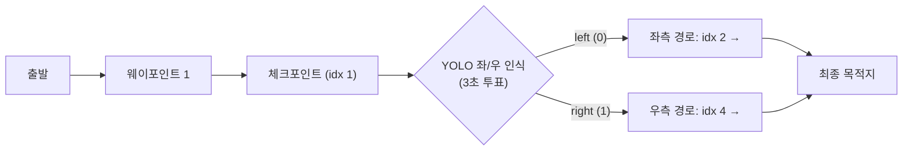
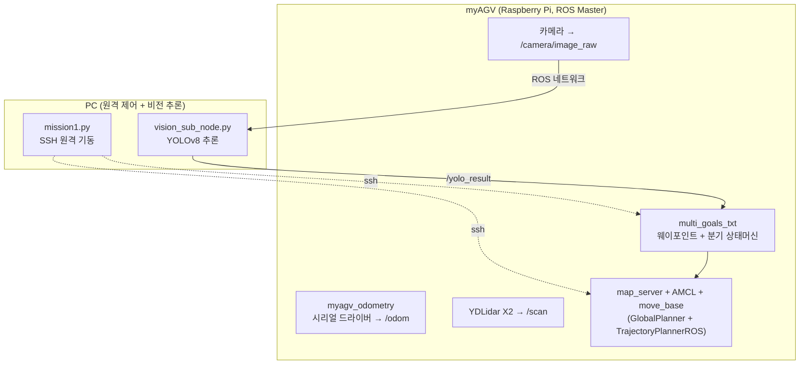
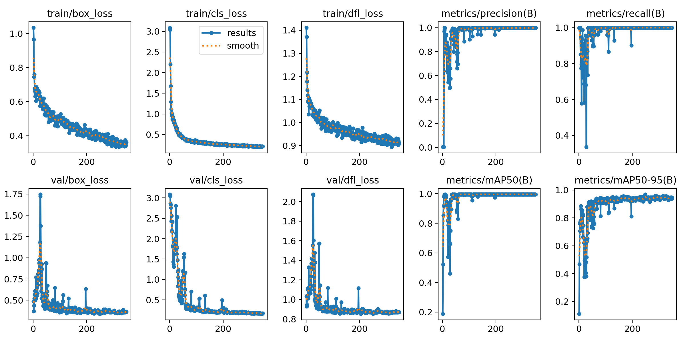
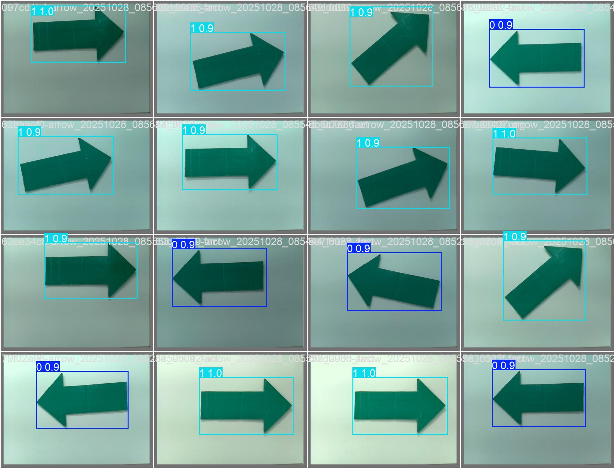

# MyAGV 자율주행 프로젝트

**myAGV(Elephant Robotics) 기반 실내 자율주행 + YOLOv8 비전 경로 분기 데모**

미리 제작한 지도 위를 웨이포인트를 따라 자율주행하다가, 체크포인트에서 카메라로 **좌/우 표지판을 YOLOv8로 인식**하여 주행 경로를 실시간으로 분기하는 프로젝트입니다.

---

## 데모

### 주행 영상

[](https://youtu.be/H9M4V4CkmdY)

*(썸네일 클릭 시 YouTube 재생)*

### 주행 지도 (gmapping SLAM으로 제작)



- 해상도 0.05 m/px, 원점 (-20, -20) — [map.yaml](myagv_ros/src/myagv_navigation/map/map.yaml)
- YDLidar X2 스캔 + gmapping으로 사전 제작 후 AMCL 위치추정에 사용

---

## 시나리오



1. [goals.txt](myagv_ros/src/multi_goals_navigation/config/goals.txt)의 웨이포인트를 move_base 액션으로 순차 전송
2. 체크포인트 도착 시 비전 파이프라인 자동 실행 (카메라 ON → YOLO 추론)
3. 3초간 프레임별 최고 신뢰도 검출을 다수결 투표 → `/yolo_result` 발행 (0=left, 1=right)
4. 결과에 따라 좌/우 분기 웨이포인트로 점프, 이후 경로 계속 주행

## 시스템 구성



- **AGV**: ROS Master. 주행 스택 전체(위치추정·경로계획·모터 제어)를 담당
- **PC**: YOLOv8 추론(라즈베리파이 연산 한계 보완)과 SSH 원격 미션 기동을 담당
- 두 장비는 동일 네트워크에서 `ROS_MASTER_URI`/`ROS_IP`로 토픽을 공유

## 기술 스택

| 구분 | 내용 |
|---|---|
| 플랫폼 | myAGV (Elephant Robotics), Raspberry Pi 4 |
| OS / ROS | Ubuntu 20.04, ROS Noetic (Python 3) |
| 센서 | YDLidar X2, 카메라, 휠 오도메트리(시리얼 `/dev/ttyAMA2`) |
| SLAM / 위치추정 | gmapping, AMCL |
| 경로계획 | move_base — GlobalPlanner(전역) + TrajectoryPlannerROS(지역) |
| 비전 | YOLOv8 (ultralytics), 커스텀 학습 모델 (left/right 2클래스) |

## YOLOv8 모델

직접 촬영·라벨링한 좌/우 표지판 데이터셋으로 학습했습니다. 초기 50 epoch 모델의 인식률 문제로 **500 epoch 모델로 교체**하여 사용 중입니다.

| | 학습 결과 | 검증 예측 |
|---|---|---|
| e500 |  |  |

- 모델 경로: `myagv_ros/src/multi_goals_navigation/src/vision/train_e500_lr0/weights/best_e500.pt`
- 추론 설정: conf 0.5 / IoU 0.45, 3초 투표 윈도우, one-shot 발행

## 패키지 구조

```
myagv_ros/                        # 메인 catkin 워크스페이스
├── mission1.py                   # PC→AGV SSH 원격 미션 실행 (메인 진입점)
├── myagv_operation.py            # 대화형 런처 (라이다/텔레옵/SLAM/내비/펌프)
├── myagv_nav.py                  # navigation 단독 실행/정지
└── src/
    ├── multi_goals_navigation/   # ★ 멀티 골 주행 + 비전 분기 (핵심)
    │   ├── config/goals.txt      #   웨이포인트 (x, y, yaw°)
    │   └── src/vision/           #   YOLO 추론·오케스트레이션 노드
    ├── myagv_navigation/         # 지도·AMCL·move_base 파라미터·launch
    ├── myagv_odometry/           # 하부 제어기 시리얼 드라이버 (/odom)
    ├── myagv_teleop/, myagv_ps2/ # 키보드/조이스틱 수동 제어
    ├── navigation/               # (벤더링) ROS navigation 스택
    └── ydlidar_ros_driver/       # (벤더링) YDLidar 드라이버
myagv_ros_AGV/                    # AGV 탑재용 odometry 워크스페이스
```

## 설치 및 빌드

전제: Ubuntu 20.04 + ROS Noetic

```bash
sudo apt-get update
sudo apt-get install -y pkg-config sshpass

# 의존성 자동 설정
cd ~/MyAGV_Project/myagv_ros
chmod +x scripts/bootstrap.sh scripts/build.sh 2>/dev/null || true
bash ./scripts/bootstrap.sh
source /opt/ros/noetic/setup.bash

# 빌드
catkin_make
source devel/setup.bash

# 비전 의존성 (PC 측)
pip3 install ultralytics
```

## 실행 방법

### 1. 전체 미션 실행 (PC에서)

```bash
python3 mission1.py            # navigation → 5초 뒤 multi_goals 자동 기동
python3 mission1.py --stop     # 전체 정지
```

> `mission1.py` 상단의 `AGV_USER`/`AGV_HOST`, `vision_orchestrator.py`의 `AGV_MASTER`/`PC_IP`를 사용 네트워크에 맞게 수정하세요.

### 2. 개별 실행 (AGV에서)

```bash
python3 myagv_operation.py     # 대화형 메뉴: 1=라이다, 3=gmapping, 4=내비게이션, 8=지도 저장 ...
```

또는 launch 직접 실행:

```bash
roslaunch myagv_odometry myagv_active.launch        # 드라이버 + 라이다
roslaunch myagv_navigation myagv_slam_laser.launch  # gmapping 지도 작성
roslaunch myagv_navigation navigation_active.launch # 자율주행 (AMCL + move_base)
roslaunch multi_goals_navigation multi_goals_navigation.launch  # 멀티 골 + 비전 분기
```

### 주요 설정 (multi_goals_navigation.launch)

| 인자 | 기본값 | 설명 |
|---|---|---|
| `file` | `config/goals.txt` | 웨이포인트 파일 (`x, y, yaw°` 한 줄씩) |
| `decision_checkpoint_idx` | `1` | 비전 판정을 수행할 웨이포인트 인덱스 (0-based) |
| `left_idx` / `right_idx` | `2` / `4` | left/right 판정 시 점프할 인덱스 |
| `decision_topic` | `/yolo_result` | 판정 결과 토픽 (0=left, 1=right) |
| `must_receive_decision` | `true` | 결과 수신까지 대기 여부 |
